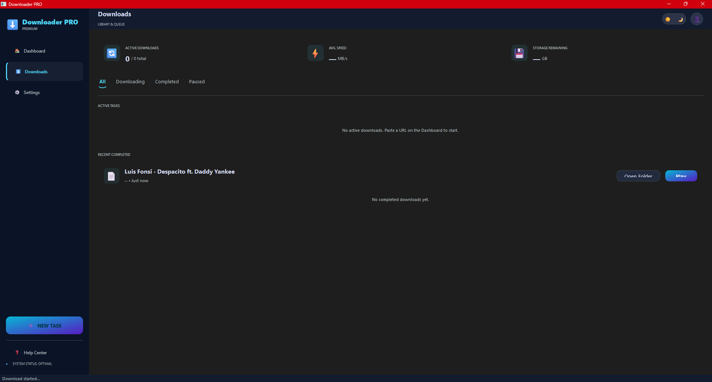
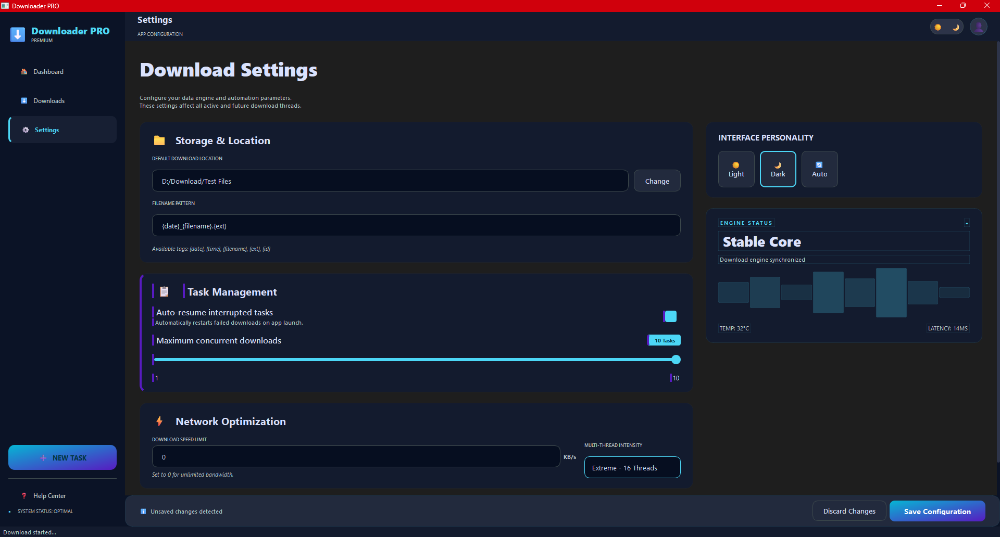

# YouTube Downloader PRO

A modern, professional YouTube video and audio downloader built with Python and PySide6. Features a clean, glassmorphic GUI with dark/light themes, detailed quality selection, and robust progress tracking powered by `yt-dlp` and `FFmpeg`.

## ✨ Features

- **Modern PySide6 GUI**: Clean, responsive, glassmorphic design.
- **Dark/Light Theme Toggle**: Proper contrast support with dynamic stylesheet generation.
- **Detailed Quality Selection**: Shows resolution, codec (H.264, VP9, AV1), bitrate, and HDR/SDR info.
- **Audio-only Downloads**: Extract high-quality MP3s easily.
- **Real-time Progress Tracking**: Shows live download speed, ETA, and file size.
- **Browser Cookie Integration**: Bypasses YouTube's rate-limiting automatically by reading browser cookies.
- **Clipboard Integration**: Quick-paste button for URLs.
- **Persistent Settings**: Remembers your preferred download location and theme.

## 🖼️ Screenshots

<p align="center">
  
  
</p>
<p align="center">
  
  
</p>
<p align="center">
  
</p>

## 🚀 Quick Start

### Prerequisites
- Python 3.8+
- [FFmpeg](https://ffmpeg.org/download.html) (Ensure it's downloaded and accessible. The app looks for `ffmpeg.exe` in the root or `tools/` folder, or in your system PATH).

### Installation

1. **Clone the repository:**
   ```bash
   git clone https://github.com/double-uRB/DownloaderPRO.git
   cd DownloaderPRO
   ```

2. **Create a Virtual Environment (Recommended):**
   ```bash
   python -m venv venv
   # On Windows:
   venv\Scripts\activate
   # On macOS/Linux:
   source venv/bin/activate
   ```

3. **Install Dependencies:**
   ```bash
   pip install -r requirements.txt
   ```

4. **Run the Application:**
    Ensure you are in the project root directory.
   ```bash
   python src/main.py
   ```

## 📖 Usage

1. Copy a YouTube URL to your clipboard.
2. Open the app and click the **Paste** button, securely fetching the video info.
3. Once the video stats are displayed, select your preferred video quality or check the **Audio (MP3)** box.
4. Choose the download directory via the folder icon.
5. Click **Download** and monitor the progress on the dashboard or in the Downloads tab.

## 🏗️ Architecture & Contributing

- Check out **[docs/ARCHITECTURE.md](docs/ARCHITECTURE.md)** for an in-depth look at how the application works internaly.
- Read **[CONTRIBUTING.md](CONTRIBUTING.md)** if you would like to contribute features or bug fixes to this project.

## ⚖️ Legal Notice
For educational and personal use only. Respect YouTube's Terms of Service and content creators' copyrights. Do not use this tool to pirate protected content.
