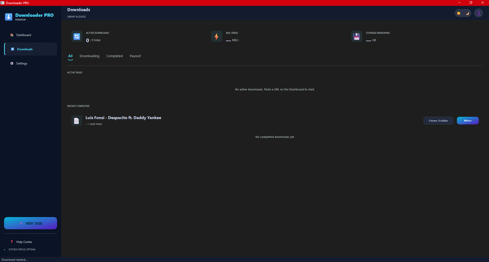

# Downloader PRO

A modern, professional YouTube video and audio downloader built with Python and PySide6. Features a clean, glassmorphic GUI with dark/light themes, high-fidelity quality selection (up to 8K), and robust multithreaded downloading. **Fully compatible with Windows, macOS, and Linux.**

    

---

## ✨ Why Downloader PRO?

Unlike most downloaders, Downloader PRO provides a **Zero-Dependency** experience. Our standalone executable bundles everything needed (Python, FFmpeg, aria2c, and SSL certificates) into a single file.

- **🚀 10x Faster Downloads**: Integrated `aria2` multithreading for maximum bandwidth utilization.
- **💎 Ultra-HD Support**: Full 4K and 8K support via official YouTube Account Login (OAuth2).
- **🎨 Stunning UI**: Modern Glassmorphism design with real-time theme switching.
- **🛡️ Anti-Block Technology**: Uses PO Tokens and custom client headers to bypass rate limits and "content unavailable" errors.
- **📦 Portable & Cross-Platform**: No installation required on Windows (standalone `.exe`). Also runs natively from source on macOS and Linux with full system integration.

## 🖼️ Screenshots

  
  

  
  

---

## 🚀 Getting Started

### 📦 For Users (Easiest)
1. Go to the **[Releases](https://github.com/double-uRB/DownloaderPRO/releases)** page.
2. Download the latest `YouTubeDownloaderPro.exe`.
3. Run it! (No Python, FFmpeg, or extra tools required).

> [!NOTE]
> Since this is a standalone tool, Windows SmartScreen may show a warning. Click "More Info" -> "Run Anyway" to proceed.

### 🛠️ For Developers / Advanced Users
If you want to run from source or build your own version:
1. **[View the Installation Guide](docs/INSTALLATION.md)** for detailed setup instructions.
2. Run `python src/main.py` once dependencies are installed.

---

## 📖 Key Features

| Feature | Details |
|---|---|
| **YouTube Login** | Uses Google's Device Flow (OAuth2) to unlock premium streams safely without sharing passwords. |
| **Advanced Mode** | Select exact video/audio formats and bitrates (H.264, VP9, AV1, MP3, AAC) for maximum control. |
| **Library Actions** | Functional "Open in Folder" and "Play" buttons in the Downloads page with cross-platform support (`open`, `xdg-open`, `explorer`) and shell-safe execution. |
| **Aria2 Acceleration** | Parallel chunk downloading for extremely high speeds even on slower connections. |
| **Resilient Parsing** | Robust audio-only stream detection (resolution-based fallback) even when YouTube metadata is incomplete. |
| **Security First** | All internal subprocess calls use list-based arguments to prevent shell injection, ensuring safe execution even with complex file paths. |
| **Custom Patterns** | Flexible filename patterns like `{date}_{title}.{ext}` via Settings. |

---

## 🏗️ Architecture & Contributing

- **[Architecture Overview](docs/ARCHITECTURE.md)**: Deep dive into the threading model and UI design system.
- **[Contributing Guide](CONTRIBUTING.md)**: Guidelines for bug reports and feature requests.

## ⚖️ Legal Notice
For educational and personal use only. Please respect YouTube's Terms of Service and content creators' copyrights.

---
Developed with ❤️ by [Rajesh Barai](https://github.com/double-uRB)
